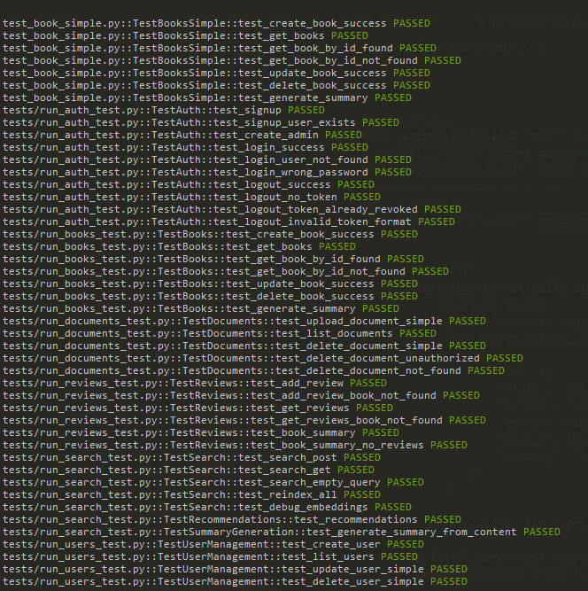
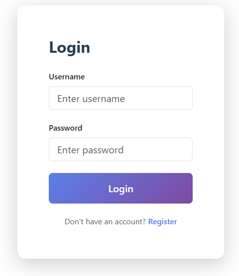

# JKTech Document Intelligence & QnA System

**Author:** Zaid Alam
**Role:** Full Stack Developer & Generative AI Engineer

This repository contains a **full-stack document intelligence platform** with **AI-powered search and summarization** capabilities.
It consists of **backend (FastAPI + PostgreSQL)** and **frontend (React + Nginx)**, fully dockerized for local development and deployment.

---

## Table of Contents

1. [Overview](#overview)
2. [Core Modules](#core-modules)
3. [API Documentation](#api-documentation)
4. [Project Setup](#project-setup)
5. [Docker & Docker Compose](#docker--docker-compose)
6. [CI/CD](#cicd)
7. [Tech Stack](#tech-stack)
8. [Frontend Features](#frontend-features)

---

## Overview

The backend manages **books, reviews, users, and documents** with **RAG-based AI search**.
All documents are stored locally and indexed for **semantic retrieval**.

Frontend is a **React application** served via **Nginx** with environment-based configuration to connect with the backend.

---

## Folder Structure

### Backend & Frontend Folder Structure


---

## Core Modules

### Backend Modules

#### Book Management

* Create, update, view, delete books
* AI-generated summaries
* Related book recommendations

#### Review Management

* Add & retrieve book reviews
* AI-based summary of reviews

#### Intelligent Search (RAG)

* Semantic search using embeddings
* Automatic reindexing on content changes

#### User Access Control

* JWT authentication
* Role-based authorization

#### Document Handling

* Upload, download, delete documents
* Local storage for files

---

### Frontend Features

* Responsive UI (mobile + desktop)
* JWT-based login system
* Dashboard showing books, documents, and statistics
* Book detail view with AI summary
* Upload & download documents
* AI-powered semantic search
* Admin panel for user management

**Environment Variables (frontend)**:

```env
REACT_APP_API_URL=http://localhost:8000
```

> Rebuild frontend after changing environment variables:

```bash
docker-compose build frontend
```

---

## API Documentation

* Swagger UI: `http://localhost:8000/docs`
* ReDoc: `http://localhost:8000/redoc`

### Main Endpoints

#### Authentication

* `POST /auth/signup` – Register user
* `POST /auth/login` – Login and receive JWT
* `POST /auth/logout` – Logout
* `POST /auth/create-admin` – Create admin

#### Books

* `POST /books` – Create book
* `GET /books` – List books
* `GET /books/{id}` – Book details
* `PUT /books/{id}` – Update book
* `DELETE /books/{id}` – Delete book
* `POST /books/{id}/generate-summary` – AI summary
* `POST /books/{id}/reindex` – Rebuild search index

#### Reviews

* `POST /books/{id}/reviews` – Add review
* `GET /books/{id}/reviews` – List reviews
* `GET /books/{id}/summary` – AI summary of reviews

#### Search & Indexing

* `GET /search` – Semantic search
* `POST /search` – Search via request body
* `POST /reindex-all` – Reindex all data

#### Admin (Restricted)

* `POST /admin/users` – Create user
* `GET /admin/users` – List users
* `PUT /admin/users/{id}` – Update user
* `DELETE /admin/users/{id}` – Delete user
* `GET /admin/users/roles` – List roles
* `POST /admin/users/roles` – Create role

#### Documents

* `POST /documents/upload` – Upload document
* `GET /documents` – List documents
* `GET /documents/{id}/download` – Download document
* `DELETE /documents/{id}` – Delete document

---

## Project Setup

### System Requirements

* Python 3.10+
* Node.js 18+
* Docker Desktop
* PostgreSQL (handled by Docker)
* OpenRouter API Key

---

### Installation

```bash
git clone <repository-url>
cd jktech-document-agent

# Backend
cd backend
pip install -r requirements.txt

# Frontend
cd ../frontend
npm install
```

### Environment (.env)

#### Backend `.env`

```env
# Application
PROJECT_NAME=Book Management System
VERSION=1.0.0
API_V1_STR=/api/v1
DEBUG=true

# Database (PostgreSQL)
POSTGRES_SERVER=db
POSTGRES_USER=postgres
POSTGRES_PASSWORD=db-password
POSTGRES_DB=db-name
POSTGRES_PORT=5432

# Leave DATABASE_URL empty - it will be auto-constructed
DATABASE_URL=

# Security
SECRET_KEY=secret-key
ALGORITHM=HS256
ACCESS_TOKEN_EXPIRE_MINUTES=120

# Redis
# REDIS_HOST=localhost
# REDIS_PORT=6379
# REDIS_PASSWORD=redis123
# REDIS_DB=0

# AI Service (OpenRouter)
OPENROUTER_MODEL=meta-llama/llama-3-70b-instruct
OPENROUTER_API_KEY=yor-key
OPENROUTER_BASE_URL=https://openrouter.ai/api/v1
AI_MODEL=meta-llama/llama-3-70b-instruct
AI_MAX_TOKENS=1000
AI_TEMPERATURE=0.7

# CORS
# BACKEND_CORS_ORIGINS=http://localhost:3000,http://localhost:5173,http://127.0.0.1:3000,http://127.0.0.1:5173,http://localhost:5174,http:localhost:3000,http://127.0.0.1:5174
BACKEND_CORS_ORIGINS=http://localhost:3000,http://localhost:5173

FRONTEND_URL=http://localhost:5173
# Logging
LOG_LEVEL=INFO
```

#### Frontend `.env`

```env
# API Configuration
VITE_API_URL=http://localhost:8000/api/v1

# Environment
VITE_ENV=development
VITE_APP_NAME="Document QA System"
VITE_APP_VERSION=1.0.0

# Features
VITE_FEATURE_REGISTRATION=true
VITE_FEATURE_FILE_UPLOAD=true
VITE_FEATURE_DARK_MODE=true
VITE_FEATURE_MULTI_LANGUAGE=false

# Application Limits
VITE_MAX_UPLOAD_SIZE=10485760
VITE_SESSION_TIMEOUT=1800000
VITE_PAGE_SIZE=10
VITE_MAX_FILE_COUNT=10
VITE_AUTO_LOGOUT_MINUTES=60

# Logging
VITE_LOG_LEVEL=debug
VITE_ENABLE_CONSOLE_LOG=true

# Monitoring
VITE_SENTRY_DSN=
VITE_GOOGLE_ANALYTICS_ID=

# Development Flags
VITE_DEBUG=true
VITE_SHOW_DEV_TOOLS=true
VITE_USE_MOCK_API=false
VITE_MOCK_API_DELAY=500
```

---

## Run Project with Docker Compose

```bash
# Stop old containers if running
docker-compose down -v

# Build and start
docker-compose up --build
```

* Backend: `http://localhost:8000`
* Frontend: `http://localhost:3000`

### Stop Containers

```bash
docker-compose down
```

---

## RAG Implementation

1. Text is converted into **vector embeddings**
2. Embeddings stored in memory for **fast semantic search**
3. On search, query vector is compared using **cosine similarity**
4. Relevant content is sent to **language model** for AI response

> Enables meaning-based search & reduces hallucinations.

---

## Docker Notes

* Backend: FastAPI + Uvicorn
* Database: PostgreSQL (docker volume persistent)
* Frontend: React build served via Nginx

---

## CI/CD (GitHub Actions)

* CI builds Docker images on **every push**
* CD deploys to server using SSH & docker-compose (pending server setup)
* Workflow path: `.github/workflows/ci.yml`

```yaml
# CI/CD snippet
- name: Build & Deploy
  run: docker-compose up --build -d
```

---

## Tech Stack

* **Backend:** FastAPI, SQLAlchemy, PostgreSQL, JWT
* **Frontend:** React, Axios, Nginx, Tailwind CSS
* **AI / RAG:** Sentence Transformers
* **DevOps:** Docker, Docker Compose, GitHub Actions

---

## Frontend Extra Features

* Responsive UI (mobile-first)
* Admin panel for users and roles
* AI document summaries
* Offline mode for testing

---

## Running Links

* Backend API Docs: `http://localhost:8000/docs`
* Frontend Application: `http://localhost:3000`

---

## Verification & Admin Access

### All Tests Passed


### Default Admin Login

- **Username:** `admin`  
- **Password:** `12345678`
---

© 2026 Zaid Alam
Full Stack Developer & Gen AI Engineer
JKTech Version 2.0
