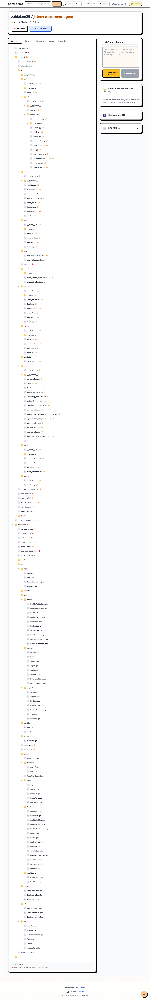

# JKTech Document Intelligence & QnA System

**Author:** Zaid Alam
**Role:** Full Stack Developer & Generative AI Engineer

This repository contains a **full-stack document intelligence platform** with **AI-powered search and summarization** capabilities.
It consists of **backend (FastAPI + PostgreSQL)** and **frontend (React + Nginx)**, fully dockerized for local development and deployment.

---

## Table of Contents

1. [Overview](#overview)
2. [Core Modules](#core-modules)
3. [API Documentation](#api-documentation)
4. [Project Setup](#project-setup)
5. [Docker & Docker Compose](#docker--docker-compose)
6. [CI/CD](#cicd)
7. [Tech Stack](#tech-stack)
8. [Frontend Features](#frontend-features)
9. [Folder Structure](#folder-structure)

---

## Overview

The backend manages **books, reviews, users, and documents** with **RAG-based AI search**.
All documents are stored locally and indexed for **semantic retrieval**.

Frontend is a **React application** served via **Nginx** with environment-based configuration to connect with the backend.


---

## Core Modules

### Backend Modules

#### Book Management

* Create, update, view, delete books
* AI-generated summaries
* Related book recommendations

#### Review Management

* Add & retrieve book reviews
* AI-based summary of reviews

#### Intelligent Search (RAG)

* Semantic search using embeddings
* Automatic reindexing on content changes

#### User Access Control

* JWT authentication
* Role-based authorization

#### Document Handling

* Upload, download, delete documents
* Local storage for files

---

### Frontend Features

* Responsive UI (mobile + desktop)
* JWT-based login system
* Dashboard showing books, documents, and statistics
* Book detail view with AI summary
* Upload & download documents
* AI-powered semantic search
* Admin panel for user management

**Environment Variables (frontend)**:

```env
REACT_APP_API_URL=http://localhost:8000
```

> Rebuild frontend after changing environment variables:

```bash
docker-compose build frontend
```

---

## API Documentation

* Swagger UI: `http://localhost:8000/docs`
* ReDoc: `http://localhost:8000/redoc`

### Main Endpoints
# Book Management System API

## API Endpoints

### Authentication
| Method | Endpoint | Description | Auth Required |
|--------|----------|-------------|---------------|
| POST | `/api/v1/auth/signup` | Register new user | No |
| POST | `/api/v1/auth/login` | Login and get JWT token | No |
| POST | `/api/v1/auth/logout` | Logout user | Yes |
| GET | `/api/v1/auth/me` | Get current user info | Yes |
| GET | `/api/v1/auth/users/details` | Get detailed user info | Yes |

### Book Management
| Method | Endpoint | Description | Auth Required |
|--------|----------|-------------|---------------|
| POST | `/api/v1/books` | Create new book with AI summary | Yes |
| GET | `/api/v1/books` | Get all books with filters | No |
| GET | `/api/v1/books/my-books` | Get books created by current user | Yes |
| GET | `/api/v1/books/{book_id}` | Get specific book | No |
| PUT | `/api/v1/books/{book_id}` | Update book | Yes |
| DELETE | `/api/v1/books/{book_id}` | Delete book | Yes |
| GET | `/api/v1/books/{book_id}/details` | Get book with reviews | No |
| POST | `/api/v1/books/{book_id}/generate-summary` | Generate AI summary | Yes |
| POST | `/api/v1/books/{book_id}/regenerate-summary` | Regenerate AI summary | Yes |
| POST | `/api/v1/books/{book_id}/reindex` | Reindex for search | Yes |
| GET | `/api/v1/books/{book_id}/summary-info` | Get summary info | No |
| GET | `/api/v1/books/stats/count` | Get total books count | No |

### Review Management
| Method | Endpoint | Description | Auth Required |
|--------|----------|-------------|---------------|
| POST | `/api/v1/reviews` | Create review | Yes |
| POST | `/api/v1/books/{book_id}/reviews` | Add review to book | Yes |
| GET | `/api/v1/reviews/book/{book_id}` | Get book reviews | No |
| GET | `/api/v1/reviews/my-reviews` | Get user's reviews | Yes |
| GET | `/api/v1/reviews/{review_id}` | Get specific review | No |
| PUT | `/api/v1/reviews/{review_id}` | Update review | Yes |
| DELETE | `/api/v1/reviews/{review_id}` | Delete review | Yes |
| GET | `/api/v1/reviews/book/{book_id}/summary` | Get review statistics | No |
| GET | `/api/v1/books/{book_id}/summary` | AI summary of reviews | No |

### Search & Indexing
| Method | Endpoint | Description | Auth Required |
|--------|----------|-------------|---------------|
| GET | `/api/v1/search` | Semantic search | No |
| POST | `/api/v1/search` | Advanced search | No |
| POST | `/api/v1/reindex-all` | Reindex all data | Yes |

### AI Summarization
| Method | Endpoint | Description | Auth Required |
|--------|----------|-------------|---------------|
| GET | `/api/v1/summaries/book/{book_id}/summary` | AI review analysis | No |
| GET | `/api/v1/summaries/book/{book_id}/summary/quick` | Quick cached summary | No |
| POST | `/api/v1/summaries/book/{book_id}/summary/refresh` | Refresh AI analysis | No |
| GET | `/api/v1/summaries/book/{book_id}/summary/status` | Check summary status | No |
| GET | `/api/v1/summaries/batch` | Get multiple summaries | No |

### Document Management
| Method | Endpoint | Description | Auth Required |
|--------|----------|-------------|---------------|
| POST | `/api/v1/documents/upload` | Upload document (PDF/TXT) | Yes |
| GET | `/api/v1/documents/` | Get all documents | Yes |
| GET | `/api/v1/documents/my-documents` | Get user's documents | Yes |
| GET | `/api/v1/documents/{document_id}` | Get specific document | Yes |
| DELETE | `/api/v1/documents/{document_id}` | Delete document | Yes |
| GET | `/api/v1/documents/{document_id}/download` | Download document | Yes |

### Ingestion Pipeline
| Method | Endpoint | Description | Auth Required |
|--------|----------|-------------|---------------|
| POST | `/api/v1/ingestion/documents/{document_id}/ingest` | Start ingestion | Yes |
| GET | `/api/v1/ingestion/documents/{document_id}/ingestion-status` | Check status | Yes |
| GET | `/api/v1/ingestion/ingestion-jobs` | Get all jobs | Yes |

### Q&A System
| Method | Endpoint | Description | Auth Required |
|--------|----------|-------------|---------------|
| POST | `/api/v1/qa/ask/{document_id}` | Ask document question | Yes |
| DELETE | `/api/v1/qa/document/{document_id}/rag` | Remove from RAG | Yes |
| GET | `/api/v1/rag/status` | Get RAG status | No |
| GET | `/api/v1/rag/documents` | Get RAG documents | No |

### Recommendations
| Method | Endpoint | Description | Auth Required |
|--------|----------|-------------|---------------|
| GET | `/api/v1/recommendations/` | Personalized recommendations | Yes |
| GET | `/api/v1/recommendations/popular` | Popular books | Yes |
| GET | `/api/v1/recommendations/new` | New releases | Yes |
| POST | `/api/v1/recommendations/clear-cache` | Clear cache | Yes |
| GET | `/api/v1/recommendations/stats` | Get stats | Yes |

### Admin Operations
| Method | Endpoint | Description | Auth Required |
|--------|----------|-------------|---------------|
| POST | `/api/v1/admin/users` | Create user | Yes (Admin) |
| GET | `/api/v1/admin/users` | Get all users | Yes (Admin) |
| PUT | `/api/v1/admin/users/{user_id}` | Update user | Yes (Admin) |
| DELETE | `/api/v1/admin/users/{user_id}` | Delete user | Yes (Admin) |
| GET | `/api/v1/admin/users/roles` | List roles | Yes (Admin) |
| POST | `/api/v1/admin/users/roles` | Create role | Yes (Admin) |
| PUT | `/api/v1/admin/users/{user_id}/roles` | Update roles | Yes (Admin) |
| PUT | `/api/v1/admin/users/{user_id}/toggle-active` | Toggle active status | Yes (Admin) |

### System Health
| Method | Endpoint | Description | Auth Required |
|--------|----------|-------------|---------------|
| GET | `/` | Root endpoint | No |
| GET | `/health` | Health check | No |
| GET | `/ping` | Ping | No |
| GET | `/api/info` | API info | No |

## Authentication
**Token Format:** `Bearer <jwt_token>`

**Base URL:** `http://localhost:8000`

## Project Setup

### System Requirements

* Python 3.10+
* Node.js 18+
* Docker Desktop
* PostgreSQL (handled by Docker)
* OpenRouter API Key

---

### Installation

```bash
git clone <repository-url>
cd jktech-document-agent

# Backend
cd backend
pip install -r requirements.txt

# Frontend
cd ../frontend
npm install
```

### Environment (.env)

#### Backend `.env`

```env
# Application
PROJECT_NAME=Book Management System
VERSION=1.0.0
API_V1_STR=/api/v1
DEBUG=true

# Database (PostgreSQL)
POSTGRES_SERVER=db
POSTGRES_USER=postgres
POSTGRES_PASSWORD=db-password
POSTGRES_DB=db-name
POSTGRES_PORT=5432

# Leave DATABASE_URL empty - it will be auto-constructed
DATABASE_URL=

# Security
SECRET_KEY=secret-key
ALGORITHM=HS256
ACCESS_TOKEN_EXPIRE_MINUTES=120

# Redis
# REDIS_HOST=localhost
# REDIS_PORT=6379
# REDIS_PASSWORD=redis123
# REDIS_DB=0

# AI Service (OpenRouter)
OPENROUTER_MODEL=meta-llama/llama-3-70b-instruct
OPENROUTER_API_KEY=yor-key
OPENROUTER_BASE_URL=https://openrouter.ai/api/v1
AI_MODEL=meta-llama/llama-3-70b-instruct
AI_MAX_TOKENS=1000
AI_TEMPERATURE=0.7

# CORS
# BACKEND_CORS_ORIGINS=http://localhost:3000,http://localhost:5173,http://127.0.0.1:3000,http://127.0.0.1:5173,http://localhost:5174,http:localhost:3000,http://127.0.0.1:5174
BACKEND_CORS_ORIGINS=http://localhost:3000,http://localhost:5173

FRONTEND_URL=http://localhost:5173
# Logging
LOG_LEVEL=INFO
```

#### Frontend `.env`

```env
# API Configuration
VITE_API_URL=http://localhost:8000/api/v1

# Environment
VITE_ENV=development
VITE_APP_NAME="Document QA System"
VITE_APP_VERSION=1.0.0

# Features
VITE_FEATURE_REGISTRATION=true
VITE_FEATURE_FILE_UPLOAD=true
VITE_FEATURE_DARK_MODE=true
VITE_FEATURE_MULTI_LANGUAGE=false

# Application Limits
VITE_MAX_UPLOAD_SIZE=10485760
VITE_SESSION_TIMEOUT=1800000
VITE_PAGE_SIZE=10
VITE_MAX_FILE_COUNT=10
VITE_AUTO_LOGOUT_MINUTES=60

# Logging
VITE_LOG_LEVEL=debug
VITE_ENABLE_CONSOLE_LOG=true

# Monitoring
VITE_SENTRY_DSN=
VITE_GOOGLE_ANALYTICS_ID=

# Development Flags
VITE_DEBUG=true
VITE_SHOW_DEV_TOOLS=true
VITE_USE_MOCK_API=false
VITE_MOCK_API_DELAY=500
```

---

## Run Project with Docker Compose

#### Docker docker-compose.yml File

```env
services:
  db:
    image: postgres:15
    container_name: jktech-postgres
    environment:
      POSTGRES_DB: bookdb
      POSTGRES_USER: postgres
      POSTGRES_PASSWORD: Badshahkhan@123
    ports:
      - "5432:5432"
    volumes:
      - postgres_data:/var/lib/postgresql/data

  backend:
    build: ./backend
    container_name: jktech-backend
    ports:
      - "8000:8000"
    env_file:
      - ./backend/.env
    depends_on:
      - db
    command: uvicorn app.main:app --host 0.0.0.0 --port 8000 --reload

  frontend:
    image: node:20-alpine  
    container_name: jktech-frontend
    working_dir: /app
    volumes:
      - ./frontend:/app
      - /app/node_modules
    ports:
      - "3000:5173"
    command: sh -c "npm install && npm run dev -- --host 0.0.0.0 --port 5173"
    stdin_open: true
    tty: true
    depends_on:
      - backend


volumes:
  postgres_data:

```

---


```bash
# Stop old containers if running
docker-compose down -v

# Build and start
docker-compose up --build
```

* Backend: `http://localhost:8000`
* Frontend: `http://localhost:3000`

### Stop Containers

```bash
docker-compose down
```

### Test Backend Command

```bash
docker compose exec backend pytest
```
### Test Frontend Command

```bash
docker compose exec frontend npm test
```
---

## RAG Implementation

1. Text is converted into **vector embeddings**
2. Embeddings stored in memory for **fast semantic search**
3. On search, query vector is compared using **cosine similarity**
4. Relevant content is sent to **language model** for AI response

> Enables meaning-based search & reduces hallucinations.

---

## Docker Notes

* Backend: FastAPI + Uvicorn
* Database: PostgreSQL (docker volume persistent)
* Frontend: React build served via Nginx

---

## CI/CD (GitHub Actions)

* CI builds Docker images on **every push**
* CD deploys to server using SSH & docker-compose (pending server setup)
* Workflow path: `.github/workflows/ci.yml`

```yaml
# CI/CD snippet
- name: Build & Deploy
  run: docker-compose up --build -d
```

---

## Tech Stack

* **Backend:** FastAPI, SQLAlchemy, PostgreSQL, JWT
* **Frontend:** React, Axios, Nginx, Tailwind CSS
* **AI / RAG:** Sentence Transformers
* **DevOps:** Docker, Docker Compose, GitHub Actions

---

## Frontend Extra Features

* Responsive UI (mobile-first)
* Admin panel for users and roles
* AI document summaries
* Offline mode for testing

---

## Running Links

* Backend API Docs: `http://localhost:8000/docs`
* Dcoker Frontend Application: `http://localhost:3000`
* Local Frontend Application: `http://localhost:5173`

---

### Default Admin Login
- **Username:** `admin`  
- **Password:** `12345678`
---

## Folder Structure

### Backend & Frontend Folder Structure



---

© 2026 Zaid Alam
Full Stack Developer & Gen AI Engineer
JKTech Version 2.0
